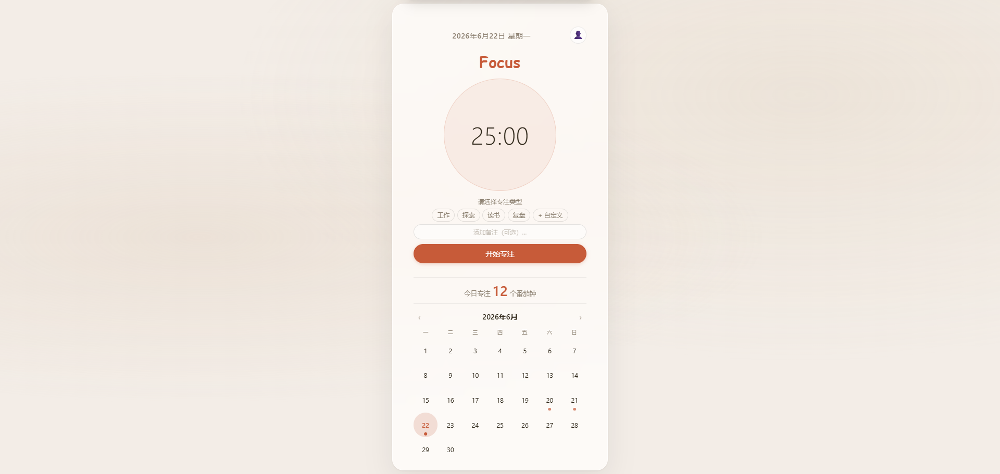
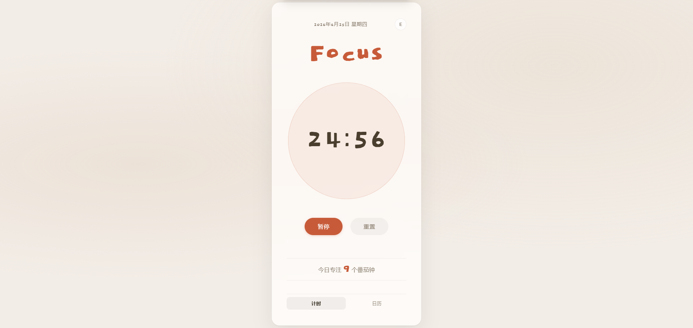
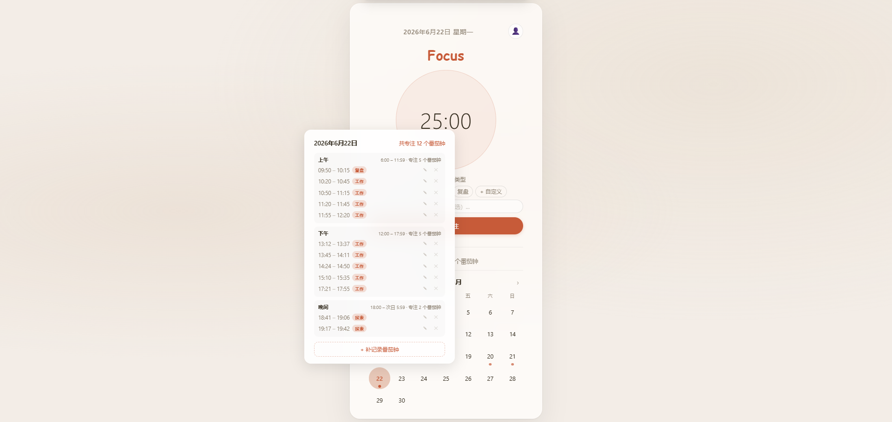

中文 | [English](README_English.md)

# 🍅 番茄时钟

一个简洁的番茄工作法计时器，帮助我们进入专注状态，25分钟专注+5分钟休息，循环往复进入心流。

## ✨ 功能

- **番茄计时** — 25 分钟专注 + 5 分钟休息，经典番茄工作法
- **断点恢复** — 计时状态多重持久化，页面刷新或意外关闭后计时继续进行
- **任务分类** — 自定义专注类型（学习、工作、阅读等）
- **备注记录** — 每个番茄钟可添加备注，记录具体专注事项
- **日历视图** — 查看每日专注数据，分早中晚时段统计专注番茄钟数
- **云端同步** — 注册登录后，多设备同步专注数据（未登录也可使用，仅本地存储）

## 🖼️ 截图

## 🌐 在线地址

https://tomato-focus-x.netlify.app/

## 🚀 本地运行

1. 将 `index.html`、`script.js`、`style.css` 三个文件下载到本地同一文件夹
2. 双击 `index.html` 即可在浏览器中使用，无需安装任何依赖

## 🎯 快速开始

1. 打开应用后选择专注类型
2. 点击"开始"按钮启动25分钟专注计时
3. 计时结束后自动切换为5分钟休息时间
4. 可选择添加备注记录本番茄的专注内容
5. 登录账号后，专注数据自动同步至云端，多设备可查看历史数据

## 🛠️ 技术栈

- 原生 HTML / CSS / JavaScript
- [Supabase](https://supabase.com) — 数据库和用户认证
- [Netlify](https://netlify.com) — 部署托管

---

**祝你专注其中，享受番茄时光！** 🍅
