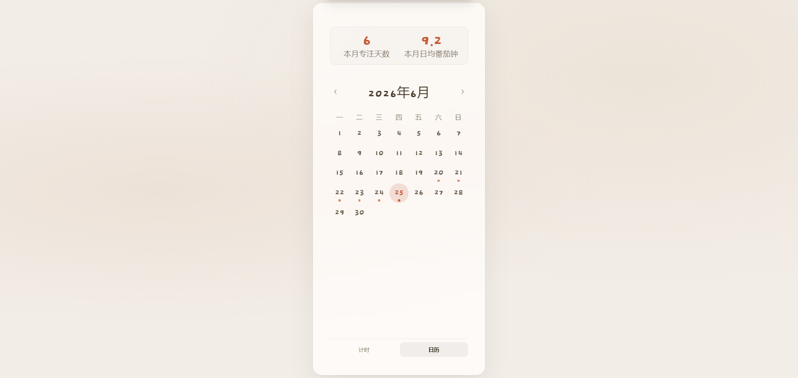
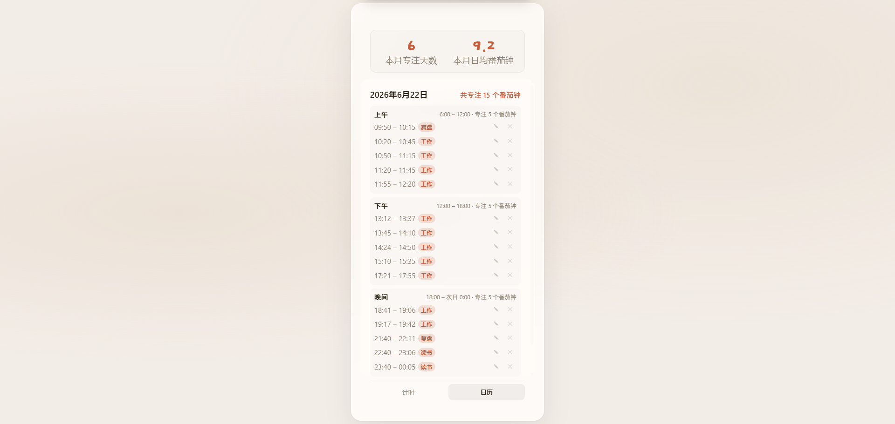

[中文](README.md) | English

# 🍅 Tomato Focus

A clean and simple Pomodoro timer to help us get into the zone faster. Cycle through 25-minute focus sessions and 5-minute breaks to effortlessly achieve a flow state.

## ✨ Features

- **Pomodoro Timer** — Classic 25-minute focus sessions + 5-minute breaks
- **Smart Resume** — Multiple persistence layers ensure your timer continues even after page refresh or accidental closure
- **Task Categories** — Customize focus types (Study, Work, Reading, etc.) and manage them all in one place
- **Notes & Tracking** — Add notes to each session to record what you worked on
- **Calendar View** — Track monthly overview (active days, daily averages) and dive into daily stats broken down by 6-hour intervals, with dynamic shifts for early hours
- **Cloud Sync** — Sign in to sync focus data across multiple devices and manage your profile name. It works offline too, with data stored securely on your local device

## 🖼️ Screenshots

## 🌐 Live Demo

https://tomato-focus-x.netlify.app/

## 🏠 Local Usage

1. Download `index.html`, `script.js`, and `style.css` to the same folder
2. Double-click `index.html` to use it in your browser — no dependencies required

## 🎯 Quick Start

1. Select a focus category after opening the app
2. Click the "Start" button to begin a 25-minute focus session
3. Timer automatically switches to 5-minute rest after completion
4. Optionally add notes to record what you focused on
5. Login to sync data to the cloud and access history across devices

## 🛠️ Tech Stack

- Vanilla HTML / CSS / JavaScript
- [Supabase](https://supabase.com) — Database & User Authentication
- [Netlify](https://netlify.com) — Hosting & Deployment

---

**Stay focused, Savor every flow.🍅**
